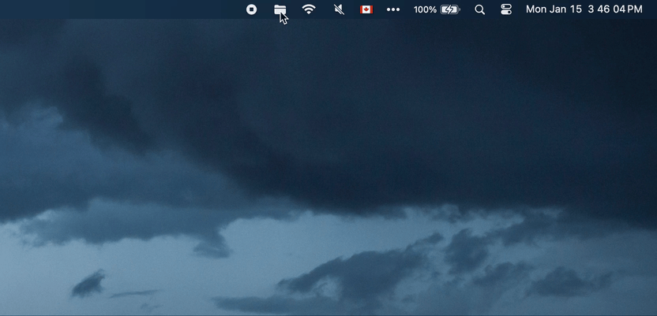
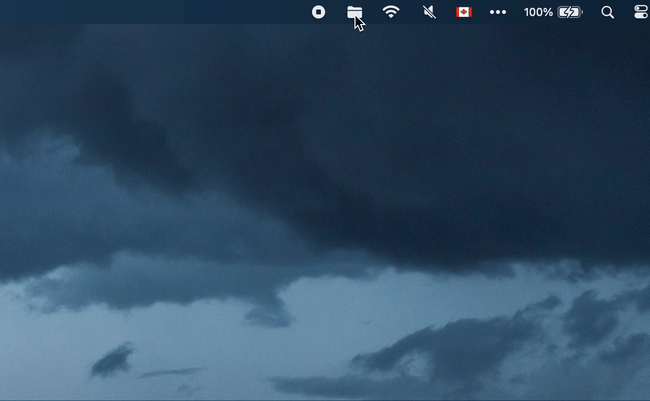

    <h1>
         
        ZFinder
    </h1>

A MacOS menu bar app to access your files/folders/applications quickly.

    

## Features

 Pin Files/Folders/Applications 

    

 Open pins 

    

 Preview files 

    

 Search pins 

    

 Rename pins 

    

 Change pin colors 

    

 Launch at login 

    

 Hide file extensions 

    

 Reorder pins 

    

 Delete pins 

    

<!-- 
- open file/folder/application
- preview file
- search by name or path
- rename pins
- change pin color
- launch at login
- hide file extensions
- reorder pins
- delete pins 
-->